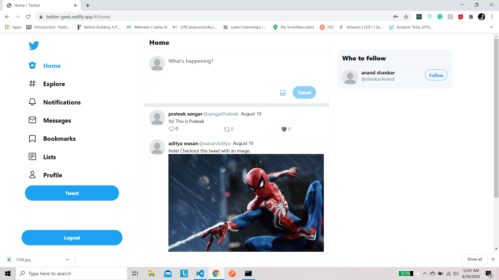

# CyberConnect Twitter

## Acknowdgment

### - Thanks to @RisingGeek for <github.com/RidingGeek/twitter-clone> and <github.com/RidingGeek/twitter-clone-backend>

### - Thanks to Amaury <amaurym10@protonmail.com> for <github.com/amaurym/login-with-metamask-demo>

### - Thanks to someone for <github.com/cyberconnecthq/follow-button>

### - Thanks to someone for github.com/cyberconnecthq/cyberconnect-starter


## 1. Introduction
CCTwitter is built on CyberConnect, Web3, React, Redux, MySQL, Cloudinary.




## 2. Features

### Existing Features

1. Signup/Login
2. Add tweet
3. Follow people with CyberConnect
4. Like, Retweet, Comment
5. View profile
6. Search users in explore section
7. Add bookmarks
8. Dark/White theme

### Upcoming Features

1. Notifications
2. Live updations of like, retweet


## 3. Run Backend

### Requirements
```
Node, Yarn, MySQL, Cloudinary
```

### Edit `back/.env` as the following contents:

```
DB_NAME = <DATABASE_NAME>
DB_USER = <DATABASE_USER>
DB_PASSWORD = <DATABASE_PASSWORD>
DB_HOST = <DATABASE_HOST>
DB_PORT = <DATABASE_PORT>
CLOUDINARY_URL = <CLOUDINARY_URL>
SECRET_KEY = <YOUR_SECRET_KEY>
```

### Install & Run
```
cd backtend
yarn install
yarn start
```


## 4. Run Frontend

### Requirements
```
Node, Yarn
```

### Edit  `frontend/.env.development` as the following contents:

```
REACT_APP_SERVER_URL=http://localhost:5000
REACT_APP_SECRET_KEY=<YOUR_SECRET_KEY>
```
### Install & Run
```
cd frontend
yarn install
yarn start
```


## 5. Usage

### Requirements
```
Browser with MetaMask extension, Ethereum Account
```

### Browse the following URL
[http://localhost:3000](http://localhost:3000)


## 6. Demo

### Demo URL
[https://twitter-geek.netlify.app/](https://twitter-geek.netlify.app/)

### Demo Account

```
username: demoaccount
password: 12345678
```

