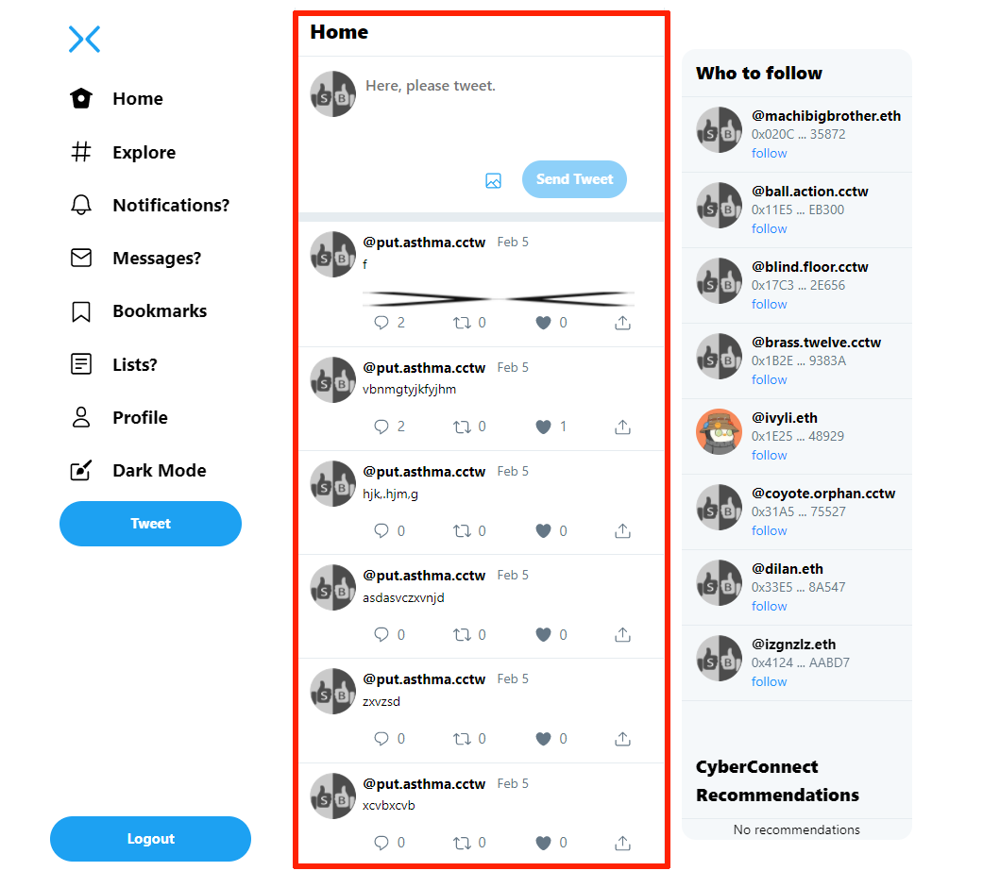
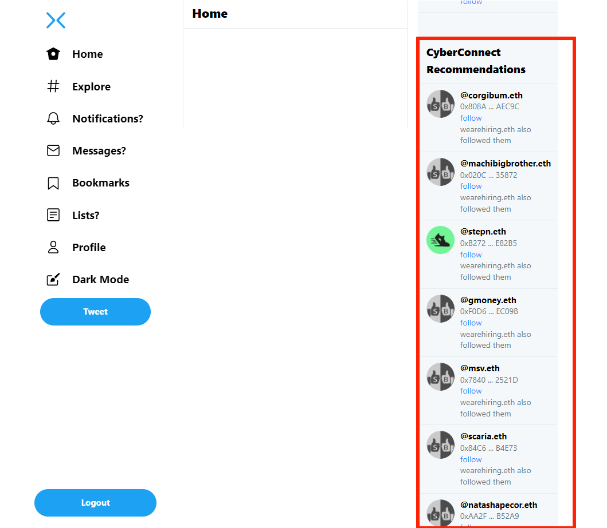
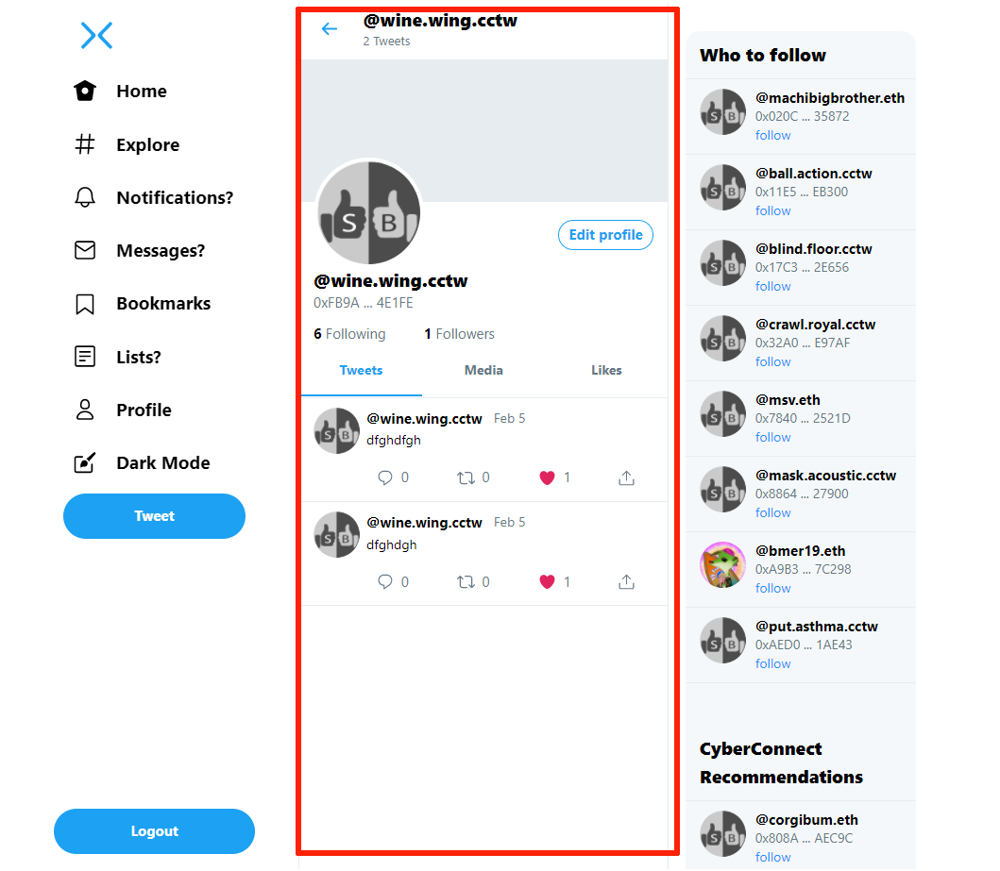
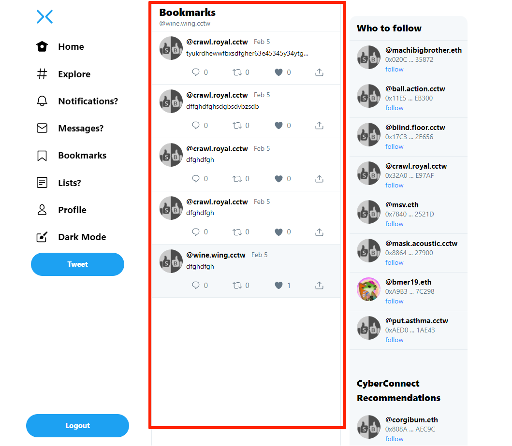
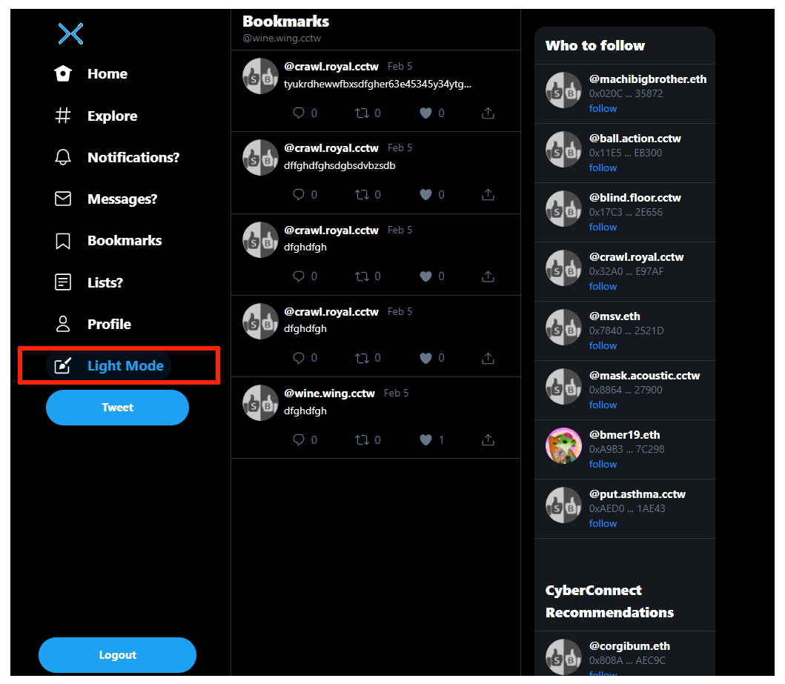

# CyberConnect Twitter

## Acknowdgment

### - Thanks to CyberConnect Team and @Jiafeng for a good technology and this bounty

### - Thanks to <github.com/cyberconnecthq/cyberconnect-starter>

### - Thanks to <github.com/cyberconnecthq/follow-button>

### - Thanks to @RisingGeek for <github.com/RidingGeek/twitter-clone> and <github.com/RidingGeek/twitter-clone-backend>

### - Thanks to Amaury <amaurym10@protonmail.com> for <github.com/amaurym/login-with-metamask-demo>


## 1. Introduction
CCTwitter is a  sample twitter built on CyberConnect, React, Redux, Next, MySQL, Cloudinary.


## 2. Features

### Existing Features

1. Signup/Login with Metamask
2. Tweeting
3. Follow people with CyberConnect
4. Recommends people with CyberConnect
5. Like, Retweet, Comment
6. Profile
7. Explore users
8. Bookmarking
9. Theme (Dark/White)

### Upcoming Features

1. More recommends with CyberConnect
2. Connection Indexing with CyberConnect
3. P2P Twittering
4. Notifications, Messages, Lists, Live updations of like, retweet


## 3. Run Backend

### [ Requirements ]
```
Node, Yarn, MySQL, Cloudinary
```

### [ Install Node.js and Yarn ]
* My Node version is v16.13.0

* My NPM version is 6.1.0

* My Yarn version is 1.22.17


### [ Install & Start MySql ]

  My MySql version is MariaDB 10.6
### [ Create a Database in MySql ]

  In my case, database name is "twitter")

### [ Import Database Sample ] (Optional)

   import file "database-sample/cctwitter.sql"

   (I did it by HeidiSQL)

### [ Register to Cloudinary to get service url and key ]
  This is required to upload media.

### [ Edit `backend/.env` ]

```
DB_NAME = <DATABASE_NAME>
DB_USER = <DATABASE_USER>
DB_PASSWORD = <DATABASE_PASSWORD>
DB_HOST = <DATABASE_HOST>
DB_PORT = <DATABASE_PORT>
CLOUDINARY_URL = <CLOUDINARY_URL>
SECRET_KEY = <YOUR_SECRET_KEY>
```

### [ Install & Run ]
```
cd backend
yarn install
yarn start
```


## 4. Run Frontend

### [ Requirements ]
```
Node, Yarn
```

### [ Edit  `frontend/next.config.js` ]

```
module.exports = {
  reactStrictMode: true,
  env: {
    mode: 'development',
    REACT_APP_BACKEND_URL:<YOUR_BACKEND_URL>,
    REACT_APP_SECRET_KEY:<YOUR_SECRET_KEY>,
    SERVER_SIDE_PAGE_TRANSITION: false,
  },
  images: {
    domains: ['res.cloudinary.com'],
  },
};
```
### [ Install & Run ]
```
cd frontend
yarn install
(optional)yarn build
yarn start or yarn dev
```


## 5. Usage

### [ Requirements ]
```
Browser with MetaMask extension, Ethereum Account
```

### Browse the following URL
[http://localhost:3000](http://localhost:3000)


## 6. Usage

### 1. Login

#### [ Login Screen ]


#### [ Unlock Wallet ]

Metamask unlock can be requested during the login process.

If the wallet is already open, it is skipped.


#### [ Choose Wallet Account ]

If there are multiple accounts in the wallet, you need to select the account and connect it to the site.

If the account is selected, it is skipped.


#### [ Sign a login message ]


#### [ Home ]

On Home, tweets from people you follow are displayed.


#### [ Menubar ]

Items with question mark "?" are not implemented yet.


#### [ Sidebar ]

Shows the people you can follow among users registered in the database. Limited to 8 people.


#### [ Recommendations ]

It sits at the bottom of the sidebar.

Shows who CyberConnect recommends. Currently limited to 30 people.



#### [ Profile ]

Display the user's tweets.

Edit the user's avatar and other information.



#### [ Bookmarks ]

Show tweets marked by the user.



#### [ Explore ]

Find users registered in database by domain name.

This function is limited to users registered in the database.


#### [ Theme ]

Two themes(Black/White) are provided.



## 7. Project Explanation

### 1. Goal
The deadline for the bounty is 20 days.

It is difficult to create a high-level product by exploiting all the possibilities of CyberConnect during this period.

Therefore, in this project, the main goal was to show my skills and potential and to make a reusable code base.

The specific items of the goal are as follows.
* To have a rudimentary form of Twitter.
* Using advanced frameworks such as React, Redax, Next, and Cloudinary as much as possible.
* Developing the backend and frontend separately in consideration of scalability
* To clearly show the possibility of combining with CyberConnect.

### 2. Choose Architectire

The following three architectures were considered.


* Option 1 is the ideal type of dApps. However, it is impossible to realize at this moment because the distributed services for Twitter are not provided.

* Option 2 has the advantage that the new service can easily solve the cold start problem by using the follow data already established in CyberConnect.

  In the case of a newcomers, since there is no follow data already established in CyberConnect, it may not be very helpful.

  In addition, follow data established in CyberConnect is mainly related to NFT.

  Twitter does not exclusively serve the NFT, so even in this case, the already established follow data may not be very helpful.

  From this, in this project, attention was paid to making the site interesting even for newcomers or those who are not interested in NFT.

  This option uses cyberconnect, but structurally, it is no dApp and is no different from the traditional app because the user completely depends on the central server.

  So option 2 lost weight.

* Option 3 is a hybrid of traditional apps and dApps.

  In other words, Twitter functions depend on a central server and follow functions operate like a dApp.

In the end, to have a sense of challenge, I chose option 3 experimentally in this bounty.

### 3. Login with Metamask
If we truly want to do a dApp, we must use a suitable login method.
Login using email or social account is the most commonly used now.

This method is subordinate to large corporations.

In addition, this login method requires additional identification information, such as phone number verification, and does not directly show the payment relationship.

Logging in using a blockchain account opens up many possibilities as you directly link the user's wallet while giving the user full rights.

#### [ Login mechanism ]
* When the user presses the login button, the browser sends the user's wallet account number to the backend to request login.

  (At this point, the browser may ask to unlock the wallet.)

* Then the backend returns the browser with the randomly generated nonce value.

* The browser signs the nonce value with the wallet secret password and sends it back to the server.

* The backend verifies the signature and, if correct, issues a session token and returns it to the browser.

  The backend also adds the account to the database if it is not in the database.

* The security check between the browser and the backend in the session is done using tokens.

### 4. Temporary Domain Name
The wallet account number is a long numeric value.

It is difficult for people to recognize and use this.

In order to solve this problem, various methods for allocating a domain name to each person have been proposed.

These methods usually require the purchase of NFT tokens or a certain registration procedure.

However, the person who has just created an account has not yet purchased an NFT or registered a domain.

But until then, it's very convenient to have some name.

Therefore, according to the following rules, a temporary domain name was created from the wallet account number.

* Convert wallet account numbers into word strings according to the bip39 rule.

* Select the first and last words in the word string and add some application-specific suffixes to them.

  For example, 

```

if the wallet account number == "0xFb9AbcAaACC5049f43746a41B8Bc8c611514E1FE", 
the first word of bip39 == "wine" && the last word of bip39  == "wing".

Thus a temporary domain == "wine.wing.cctw".
Here "cctw" is application specific suffix.

```

The domain can be used conveniently and temporarily until the user purchases the official domain.

The possibility of overlapping temporary domains is 1 in 2048^2, which is very small.

In addition, the temporary domain is only displayed to the user, and there is no damage even if it is duplicated because the wallet account number is used internally.

### 5. Follow

When the user presses the follow button, the browser first directly accesses the end point of CyberConnect's service and adds the connection. 

If it succeeds, the browser sends a request to the backend to register the connection with the database.

The same goes for unfollowing.

At a certain point in time, a discrepancy may be created between the information in the database and the cyberconnect.

This issue should be addressed in the future.

### 6. Recommendations

Although it is said that a lot of connection information has been established in CyberConnect, meaningful connection information cannot exist in the case of a new person who has just created an account.

Recommendations are displayed even for newcomers, so recommendations were more practical for newcomers before sufficient connection information was established.

Therefore, it is decided to display the recommendations rather than the current connections.


